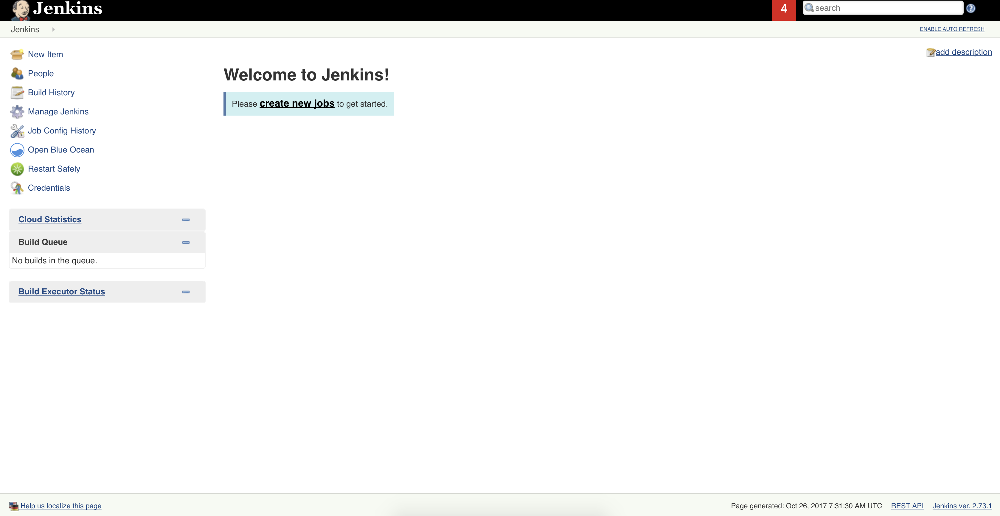
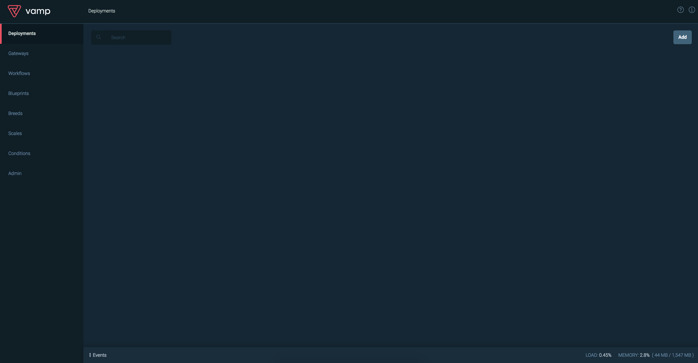

# MesosCon Europe 2017 - Doing DevOps with DC/OS


## Deploy a DC/OS cluster using Azure Container Service

* From the portal do a search for ACS
* Deploy a 1 master / 3 nodes DS2_V2 (Minimum)
* Paste your public key generated
* Validate your deployment and wait around 10 minutes after the deployment done
* SSH Tunnel to the cluster

``` bash
# Example to initiate the SSH Tunnel command
sudo ssh azureuser@mesosconjustrohmgmt.westeurope.cloudapp.azure.com -i dcosDemo -L 80:localhost:80
```
> The `dcosDemo` file is my private key, you have to create your own and pass it on the Azure Portal before your deployment.

After your ssh tunnel connexion, you should be able to reach the DC/OS Admin portal from [http://localhost](http://localhost)

## DC/OS CLI

Make sure to have the CLI installed : [Instructions here](https://github.com/dcos/dcos-cli)

Setup the connection to your cluster

```
$ dcos cluster setup http://localhost
$ dcos auth login
Login successful!
```

## Install Jenkins

We will use the official package from the universe, you can either deploy it from the portal or the cli.

```bash
$ dcos package install --yes jenkins
```

After few minutes you should be able to reach the Jenkins Dashboard using the following url : [http://localhost/service/jenkins/](http://localhost/service/jenkins/)

> To see the state of the deployment you can use `dcos marathon app list` command



## Deploy MySQL for VAMP's persistence

```bash
$ dcos package install --yes mysql
```

## Install VAMP

From the official documentation [https://vamp.io/documentation/installation/v0.9.5/dcos/](https://vamp.io/documentation/installation/v0.9.5/dcos/)

1. We will deploy Elastic Search
2. We will deploy VAMP.io

```bash
# Deployment of Elastic Search
$ dcos marathon app add ./vamp/elasticsearch.json
Created deployment f7a480d4-4638-4187-b736-4828793e9e6f
$ dcos marathon app list
```

Wait after the elasticsearch deployment to be healthy

```bash
# Deployment of Elastic Search
$ dcos marathon app add ./vamp/vamp.json
Created deployment df110fdb-3d45-4029-b6e7-ba38904b6cd1
$ dcos marathon app list
```

When the VAMP deployment is healthy you should be able to acces to the dashboard with the following URL : [http://localhost/service/vamp/#/vamp/deployments](http://localhost/service/vamp/#/vamp/deployments)



# Hello World deployment using Vamp

1. Deploy `hello-worldDeploy.yml` from the hello-world folder
2. Deploy `hello-worldGW.yml` from the hello-world folder

# Deploying the application

You can find the three repos (Clients, OrderAPI and DatabaseMongo) here : [https://github.com/PartsUnlimitedMRP](https://github.com/PartsUnlimitedMRP)

## MongoDB

First we will run MongoDB inside the cluster. This deploument is not in best practices for production but ok for our demo since the backend is not our main focus.

Deploy `mongodb.json` from the DC/OS Dashboard.

## Create the Jenkins pipelines

### Setup the secrets in Jenkins

* From Jenkins
* Click on Credentials
* Add credentials
* Fill your username and password with the ID = dockerhub

### OrderAPI

* New Item
* Pipeline project
* GH Project
* Pipeline from SCM : https://github.com/PartsUnlimitedMRP/OrderAPI
* Save
* Build Now

### Client

* New Item
* Pipeline project
* GH Project
* Pipeline from SCM : https://github.com/PartsUnlimitedMRP/Clients
* Save
* Build Now

## Custom DNS

This demo is using my custom DNS `julien.work`, if you want to setup your own, you have to fork the PUMRP repository, Clients and OrderAPI, and change the `updategw100.yaml` and `updategw50.yaml` files with your own DNS under the `virtual_hosts` section.